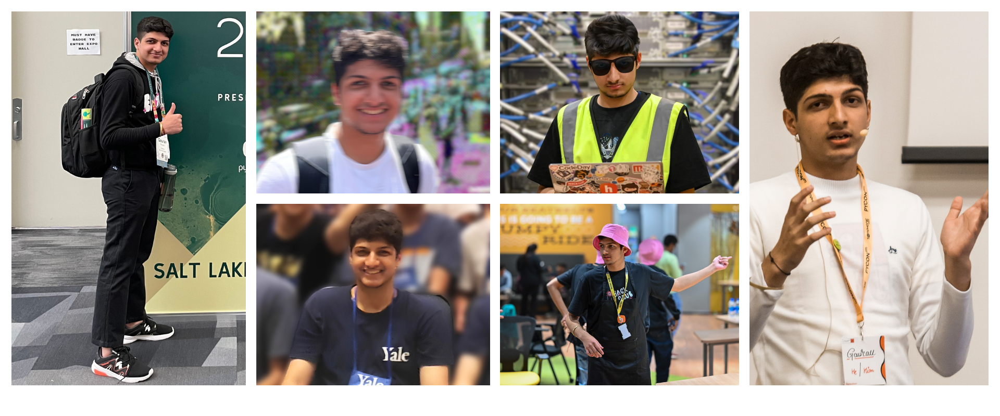

A simple Next.JS Portfolio website of Gaurav!

```python
print("hey, I'm Gaurav a.k.a GP!")
```


a high school junior from New Delhi, India. I work at [CodeDay]("https://codeday.org"), where I work to provide welcoming and diverse opportunities for underserved students to explore a future in tech and beyond.

since 2007, I've done everything from living in the snowy mountains and hiking in the beautiful hills of Uttarakhand to studying in India's capital city and travelling to Florence and Rome. I find joy in ambiguity and feel more engaged when working on problems that can be solved by mainly exploring the web or reading a book.

[[Posts]]("https://pandeygaurav.com/posts")
<br>
[[Newsletter]]("/")

computers has seriously changed my life. I began coding when I was in the ninth grade, and since then I've been invited to give talk in Florence, Salt Lake City, Singapore, Seattle and London.

Say Hi! at: hey@pandeygaurav.com